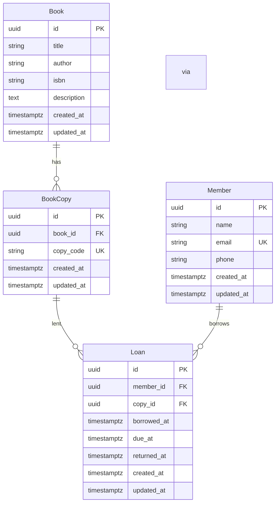

# Architecture

## DB schema



- One active loan per copy: unique partial index on `loans.copy_id` where `returned_at IS NULL`.
- FKs use `ON DELETE RESTRICT`.

## Project structure

```
apis/                    # FastAPI backend
  app/
    api/routes/          # HTTP handlers (controllers)
    services/            # Business logic
    repositories/        # Data access
    schemas/             # Pydantic request/response
    models/              # SQLAlchemy ORM
    db/                  # Session, config, base
  scripts/
    migrate.py           # Create tables (idempotent); --clean to drop+create
    seed_data.py         # Seed books, members, copies (idempotent)
    entrypoint.sh        # Wait Postgres → migrate → seed → uvicorn
  main.py

web/                     # Next.js frontend
  app/                   # App Router (layout, page)
  components/            # UI sections (Books, Members, Copies, Borrow, Loans)
  lib/api.ts             # API client and types

deploy/
  docker-compose.yml     # postgres, api, web
```

## Request flow

```
Browser → Next.js (web:3000) → FastAPI (api:8000) → PostgreSQL (postgres:5432)
          ↑                         ↑
          NEXT_PUBLIC_API_URL       routes → services → repositories
```
